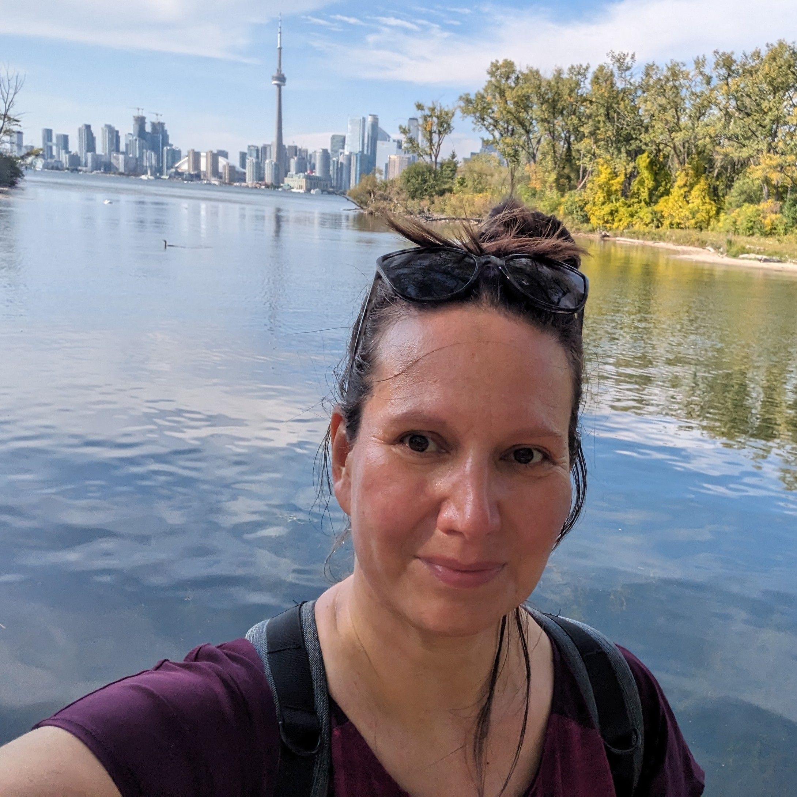
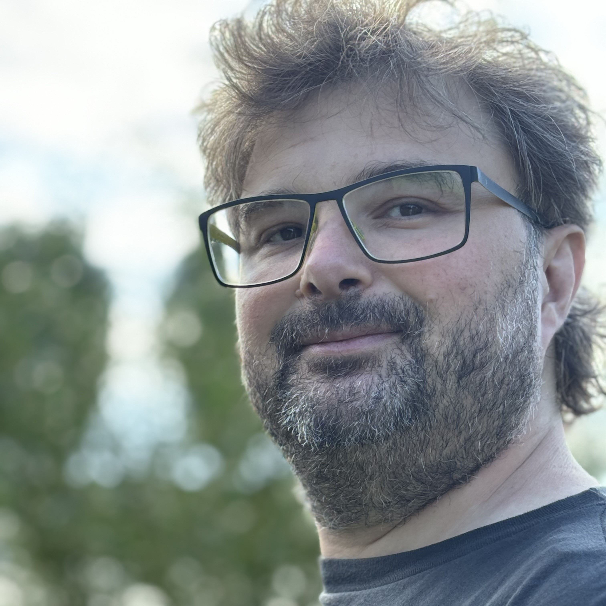

+++

title = "ACSOS 2026 Announcement"
description = "Acsos 2026 Announcement"
outputs = ["Reveal"]

+++



---

---



---



---



# General Chairs



 
Ivana Dusparic 
Trinity College Dublin, Ireland


 
Danilo Pianini 
University of Bologna, Italy



---



# Program Chairs



 
Robert René Maria Birke 
University of Turin, Italy


 
Christian Krupizer 
University of Hohenheim, Germany



---



# ACSOS 2022 Special Event

---



# Biblioteca Malatestiana

* UNESCO World Heritage Site
* First public library in Europe
* Original reading room (Aula del Nuti) from 1447 pristine and visitable, with the original desks
* Founded in 1454
* About 380,000 volumes
* Ancient manuscripts and incunabula
* Smallest book in the world readable with the naked eye

---



# Abbazia di Santa Maria del Monte
* Founded in 1001
* Romanesque architecture
* Located on the top of Monte Giove, overlooking Cesena
* Panoramic view of the city and the surrounding area
* Peaceful and spiritual atmosphere

---



# Rocca Malatestiana

* Medieval fortress
* Built in the 14th century by the Malatesta family
* Offers panoramic views of Cesena and the surrounding countryside
* Houses a museum with historical artifacts and exhibitions
* Beautiful gardens and walking paths

---



# Teatro Alessandro Bonci

* Beautiful 18th-century opera house
* Acoustics considered among the best in the world
* 1000 seats
* Inaugurated in 1846

---



# Piazza del Popolo and the city center

* Central square of Cesena
* Surrounded by historic buildings, cafes, and shops
* Hosts various events and markets throughout the year
* A great place to relax and soak in the local atmosphere
* Features a beautiful fountain (Fontana Masini), symbol of the city

---



# Nearby: Ravenna

* UNESCO World Heritage Site
* Former capital of the Western Roman Empire
* Famous for its stunning Byzantine mosaics
* Historical sites such as the Basilica of San Vitale and the Mausoleum of Galla Placidia
* Europan Capital of Culture 2019
* Dante Alighieri's tomb

---



---



---



---



# Nearby: Rimini

* Famous seaside resort on the Adriatic coast
* Long sand beaches and vibrant nightlife
* Rich history (it's the Roman Ariminum), including Roman ruins such as the Arch of Augustus and the Tiberius Bridge

---



---



---



---



---



---



# Nearby: Republic of San Marino 🇸🇲

* One of the world's smallest and oldest republics
* Located on the slopes of Monte Titano
* Known for its medieval architecture, including the Three Towers of San Marino
* Offers stunning views of the surrounding countryside and the Adriatic Sea

---



---



# Nearby: Imola and Misano International Circuits

* Imola Circuit (Autodromo Enzo e Dino Ferrari): famous for hosting Formula 1
* Misano World Circuit Marco Simoncelli: hosts MotoGP and World Superbike
    * We raced there in 2022 with karts, "Misanino" (small Misano) is a smaller-scale replica of the main circuit

---



---



---



# Also check out...
* **Cesenatico**: coastal town with a marina and seafood restaurants
* **San Leo**: medieval village with a fortress
* **Bertinoro**: charming hilltop town known for its wine
* **Brisighella**: picturesque village with a medieval castle and narrow streets
* **Foreste Casentinesi National Park**: beautiful natural area for hiking and outdoor activities

---



# Conference Location:

## University of Bologna, Cesena Campus
* Modern facilities
* Easy access to public transportation

---



---



---



---



---



---



---



---



---



---



