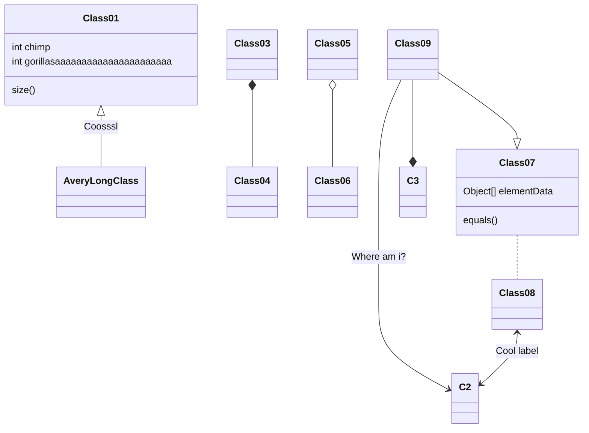
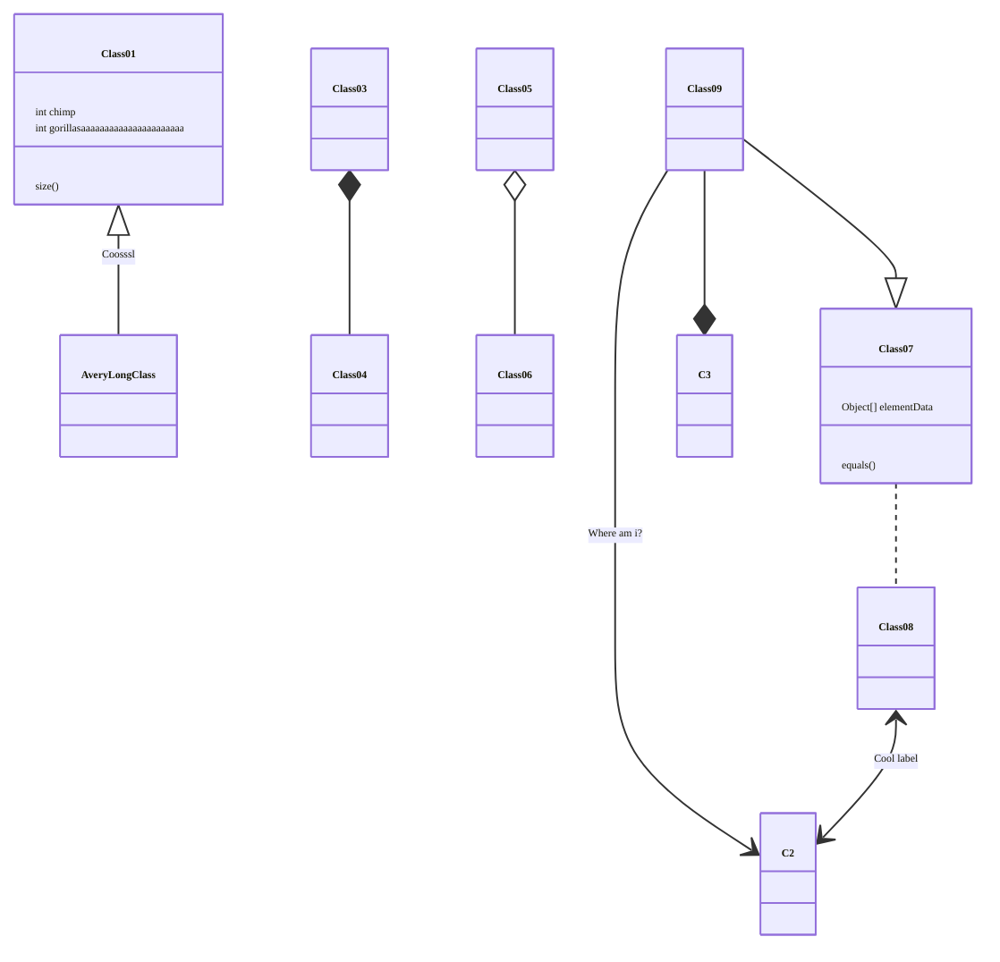
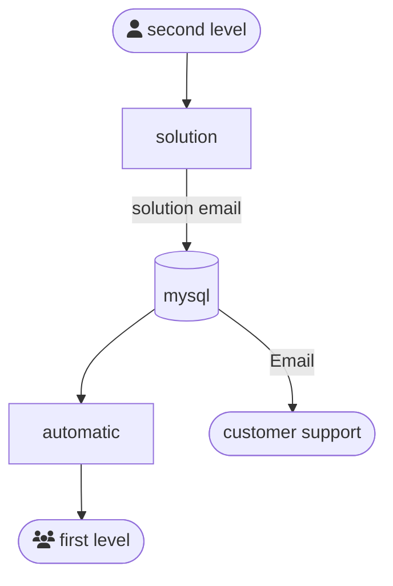
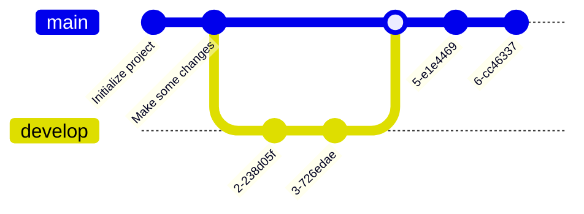

+++

title = "ACSOS 2026 Announcement"
description = "Acsos 2026 Announcement"
outputs = ["Reveal"]
aliases = [
    "/guide/"
]

+++



---


---



---




---


# General Chairs



<br>
Ivana Dusparic<br>
Trinity College Dublin, Ireland


<br>
Danilo Pianini<br>
University of Bologna, Italy



---

# Program Chairs



<br>
Robert René Maria Birke<br>
University of Turin, Italy


<br>
Christian Krupizer<br>
University of Hohenheim, Germany



---



# ACSOS 2022 Special Event

---



# Biblioteca Malatestiana

* UNESCO World Heritage Site
* First public library in Europe
* Original reading room (Aula del Nuti) from 1447 pristine and visitable, with the original desks
* Founded in 1454
* About 380,000 volumes
* Ancient manuscripts and incunabula
* Smallest book in the world readable with the naked eye

---



# Abbazia di Santa Maria del Monte
* Founded in 1001
* Romanesque architecture
* Located on the top of Monte Giove, overlooking Cesena
* Panoramic view of the city and the surrounding area
* Peaceful and spiritual atmosphere

---



# Rocca Malatestiana

* Medieval fortress
* Built in the 14th century by the Malatesta family
* Offers panoramic views of Cesena and the surrounding countryside
* Houses a museum with historical artifacts and exhibitions
* Beautiful gardens and walking paths

---



# Teatro Alessandro Bonci

* Beautiful 18th-century opera house
* Acoustics considered among the best in the world
* 1000 seats
* Inaugurated in 1846

---



# Piazza del Popolo and the city center

* Central square of Cesena
* Surrounded by historic buildings, cafes, and shops
* Hosts various events and markets throughout the year
* A great place to relax and soak in the local atmosphere
* Features a beautiful fountain (Fontana Masini), symbol of the city

---

# Nearby: Ravenna

* UNESCO World Heritage Site
* Former capital of the Western Roman Empire
* Famous for its stunning Byzantine mosaics
* Historical sites such as the Basilica of San Vitale and the Mausoleum of Galla Placidia
* Europan Capital of Culture 2019
* Dante Alighieri's tomb

---



---



---



---

# Nearby: Rimini

* Famous seaside resort on the Adriatic coast
* Long sand beaches and vibrant nightlife
* Rich history (it's the Roman Ariminum), including Roman ruins such as the Arch of Augustus and the Tiberius Bridge

---



---



---



---



---



---

# Nearby: Republic of San Marino 🇸🇲

* One of the world's smallest and oldest republics
* Located on the slopes of Monte Titano
* Known for its medieval architecture, including the Three Towers of San Marino
* Offers stunning views of the surrounding countryside and the Adriatic Sea

---



---

# Nearby: Imola and Misano International Circuits

* Imola Circuit (Autodromo Enzo e Dino Ferrari): famous for hosting Formula 1
* Misano World Circuit Marco Simoncelli: hosts MotoGP and World Superbike
    * We raced there in 2022 with karts, "Misanino" (small Misano) is a smaller-scale replica of the main circuit

---



---



---



# Also check out...
* **Cesenatico**: coastal town with a marina and seafood restaurants
* **San Leo**: medieval village with a fortress
* **Bertinoro**: charming hilltop town known for its wine
* **Brisighella**: picturesque village with a medieval castle and narrow streets
* **Foreste Casentinesi National Park**: beautiful natural area for hiking and outdoor activities

---



# Conference Location:

## University of Bologna, Cesena Campus
* Modern facilities
* Easy access to public transportation

---



---



---



---



---



---



---



## Particles.js background

---




## Ribbons background

---



## Gradient background

---

# Short guide to Markdown slides

---

# Headers

# H1
## H2
### H3
#### H4

---

# Text

normal text

`inline code`

*italic*

**bold**

**_emphasized_**

*__emphasized alternative__*

~~strikethrough~~

[link](http://www.google.com)

---

# Lists and enums

1. First ordered list item
1. Another item
    * Unordered sub-list.
    * with two items
        * another sublist
            1. With a sub-enum
            1. yay!
1. Actual numbers don't matter, just that it's a number
  1. Ordered sub-list
1. And another item.

---

# Inline images


---

## Fallback to shortcodes for resizing

Autoresize specifying

* `max-w` (percent of parent element width) and/or `max-h` (percent of viewport height) as max sizes , and
* `width` and/or `height` as *exact* sizes (as percent of viewport size)



---

## Multi-column slide

{}{}
Column 1
{}{}
Column 2
{}{}

{}
{}
Larger columns using bootstrap
{}
{}
[Link to bootstrap grid system](https://getbootstrap.com/docs/4.0/layout/grid/)
{}
{}


---

## Tick and Cross

* {} This is something good
* {} This is something bad

---

## Chart.js


{
    type: 'bar',
    data: {
        labels: ['Red', 'Blue', 'Yellow', 'Green', 'Purple', 'Orange'],
        datasets: [{
            label: 'Bar Chart',
            data: [12, 19, 18, 16, 13, 14],
            backgroundColor: [
                'rgba(255, 99, 132, 0.2)',
                'rgba(54, 162, 235, 0.2)',
                'rgba(255, 206, 86, 0.2)',
                'rgba(75, 192, 192, 0.2)',
                'rgba(153, 102, 255, 0.2)',
                'rgba(255, 159, 64, 0.2)'
            ],
            borderColor: [
                'rgba(255, 99, 132, 1)',
                'rgba(54, 162, 235, 1)',
                'rgba(255, 206, 86, 1)',
                'rgba(75, 192, 192, 1)',
                'rgba(153, 102, 255, 1)',
                'rgba(255, 159, 64, 1)'
            ],
            borderWidth: 1
        }]
    },
    options: {
        maintainAspectRatio: false,
        scales: {
            yAxes: [{
                ticks: {
                    beginAtZero: true
                }
            }]
        }
    }
}


---

## FontAwesome

<i class="fa-solid fa-mug-hot"></i>
<i class="fa-solid fa-lemon"></i>
<i class="fa-solid fa-flask"></i>
<i class="fa-solid fa-apple-whole"></i>
<i class="fa-solid fa-bacon"></i>
<i class="fa-solid fa-beer-mug-empty"></i>
<i class="fa-solid fa-pepper-hot"></i>

---

## Bootstrap 1

<div class="card w-100" >
  
  <div class="card-body">
    <h5 class="card-title">Card title</h5>
    <p class="card-text">Some quick example text to build on the card title and make up the bulk of the card's content.</p>
    <a href="#" class="btn btn-primary">Go somewhere</a>
  </div>
</div>

---

## Bootstrap 2

<button type="button" class="btn btn-primary">Primary</button>
<button type="button" class="btn btn-secondary">Secondary</button>
<button type="button" class="btn btn-success">Success</button>
<button type="button" class="btn btn-danger">Danger</button>
<button type="button" class="btn btn-warning">Warning</button>
<button type="button" class="btn btn-info">Info</button>
<button type="button" class="btn btn-light">Light</button>
<button type="button" class="btn btn-dark">Dark</button>

<button type="button" class="btn btn-link">Link</button>

---

## Low res, plain markdown


---

## Hi res, plain markdown


---



# Large images as background
## (May affect printing)

---




# Video background

---

# $$\LaTeX{}$$


Inline equations like $E=mc^2$

$$\frac{n!}{k!(n-k)!} = \binom{n}{k}$$

---

# Code snippets


```kotlin
val x = pippo
```

```go
package main

import "fmt"

func main() {
    fmt.Println("Hello world!")
}
```

---

# Tables

Colons can be used to align columns.

| Tables        | Are           | Cool  |
| ------------- |:-------------:| -----:|
| col 3 is      | right-aligned | $1600 |
| col 2 is      | centered      |   $12 |
| zebra stripes | are neat      |    $1 |

There must be at least 3 dashes separating each header cell.
The outer pipes (|) are optional, and you don't need to make the
raw Markdown line up prettily. You can also use inline Markdown.

---

# Quotes

> Multiple
> lines
> of
> a
> single
> quote
> get
> joined

> Very long one liners of Markdown text automatically get broken into a multiline quotation, which is then rendered in the slides.

---

# Fragments

* 
* 
* 

---

# Stacking images with Fragments
{}
{}
<p class="fragment" data-fragment-index="0">Pippo</p>
<p class="fragment" data-fragment-index="1">Pluto</p>
<p class="fragment" data-fragment-index="2">Paperino</p>
{}

{}
<div class="r-stack">
  
  
  
</div>
{}

{}


---

# Graphs via Gravizo


  digraph G {
    aize ="4,4";
    main [shape=box];
    main -> parse [weight=8];
    parse -> execute;
    main -> init [style=dotted];
    main -> cleanup;
    execute -> { make_string; printf}
    init -> make_string;
    edge [color=red];
    main -> printf [style=bold,label="100 times"];
    make_string [label="make a string"];
    node [shape=box,style=filled,color=".7 .3 1.0"];
    execute -> compare;
  }


---

# Graphs via mermaid.js



---


# Graphs via mermaid.js with options




---
# Graphs via mermaid.js 2



---

# Graphs via mermaid.js 3



---

# Keystrokes

<kbd>Ctrl</kbd> + <kbd>Alt</kbd> + <kbd>Del</kbd>

---

# QR code

{}

---

# Import shared slides

<!-- write-here "shared-slides/devops/devops-intro.md" -->
<!-- end-write -->
